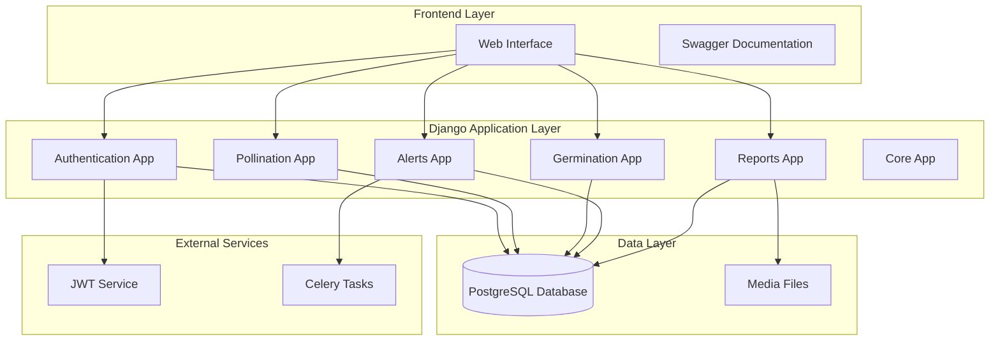
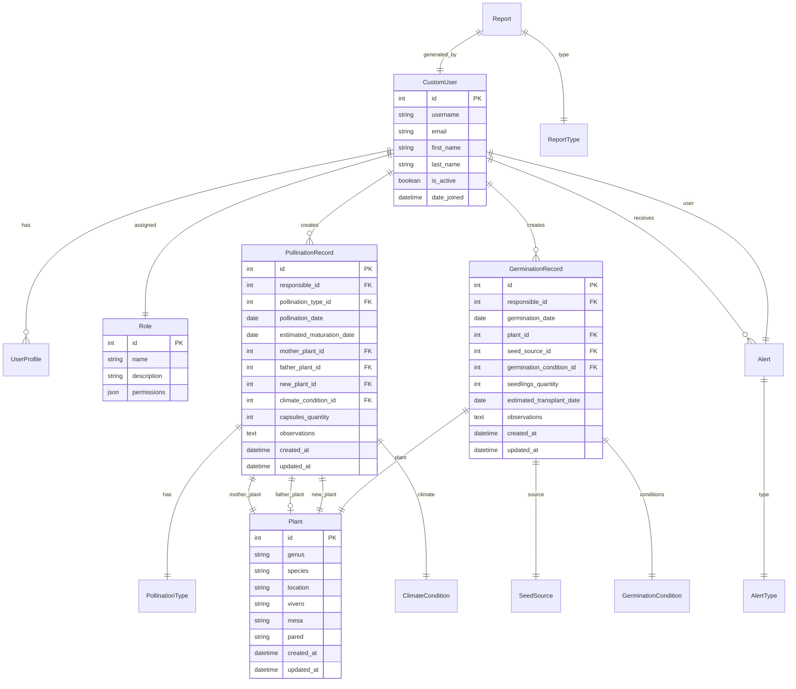

# Design Document

## Overview

El Sistema de Polinización y Germinación será desarrollado como una aplicación web Django siguiendo el patrón MVT (Model-View-Template) de Django, que es una variación del patrón MVC. La aplicación estará estructurada en múltiples apps Django para mantener separación de responsabilidades y facilitar el mantenimiento.

### Arquitectura General

La aplicación seguirá una arquitectura modular basada en Django apps:

- **authentication**: Manejo de usuarios, roles y autenticación JWT
- **pollination**: Gestión de registros de polinización
- **germination**: Gestión de registros de germinación  
- **alerts**: Sistema de alertas automáticas
- **reports**: Generación y gestión de reportes
- **core**: Utilidades compartidas y configuraciones base

## Architecture

### Diagrama de Arquitectura



### Tecnologías Principales

- **Backend**: Django 4.2+ con Django REST Framework
- **Base de Datos**: PostgreSQL (recomendado para producción)
- **Autenticación**: JWT con django-rest-framework-simplejwt
- **Documentación API**: drf-spectacular (Swagger/OpenAPI)
- **Tareas Asíncronas**: Celery con Redis/RabbitMQ
- **Validación**: Django Forms y DRF Serializers
## Compo
nents and Interfaces

### 1. Authentication App

**Models:**
- `CustomUser`: Extiende AbstractUser con campos adicionales
- `Role`: Define roles del sistema (Polinizador, Germinador, Secretaria, Administrador)
- `UserProfile`: Información adicional del usuario

**Views/ViewSets:**
- `LoginView`: Autenticación y generación de tokens JWT
- `RefreshTokenView`: Renovación de tokens
- `UserViewSet`: CRUD de usuarios (solo admin)
- `ProfileView`: Gestión de perfil personal

**Serializers:**
- `LoginSerializer`: Validación de credenciales
- `UserSerializer`: Serialización de datos de usuario
- `TokenSerializer`: Manejo de tokens JWT

### 2. Pollination App

**Models:**
- `Plant`: Información de plantas (género, especie, ubicación)
- `PollinationType`: Tipos de polinización (Self, Sibling, Híbrido)
- `PollinationRecord`: Registro principal de polinización
- `ClimateCondition`: Condiciones climáticas

**Views/ViewSets:**
- `PollinationRecordViewSet`: CRUD de registros de polinización
- `PlantViewSet`: Gestión de plantas
- `PollinationTypeViewSet`: Tipos de polinización disponibles

**Business Logic:**
- `PollinationService`: Lógica de negocio para cálculos de fechas
- `ValidationService`: Validaciones específicas por tipo de polinización

### 3. Germination App

**Models:**
- `GerminationRecord`: Registro principal de germinación
- `SeedSource`: Procedencia de semillas
- `GerminationCondition`: Condiciones del medio de germinación

**Views/ViewSets:**
- `GerminationRecordViewSet`: CRUD de registros de germinación
- `SeedSourceViewSet`: Gestión de fuentes de semillas

**Business Logic:**
- `GerminationService`: Cálculos de fechas de trasplante
- `GerminationValidationService`: Validaciones específicas

### 4. Alerts App

**Models:**
- `Alert`: Alertas generadas automáticamente
- `AlertType`: Tipos de alerta (semanal, preventiva, frecuente)
- `UserAlert`: Relación entre alertas y usuarios

**Views/ViewSets:**
- `AlertViewSet`: Consulta de alertas por usuario
- `NotificationView`: Notificaciones in-app

**Services:**
- `AlertGeneratorService`: Generación automática de alertas
- `NotificationService`: Envío de notificaciones

### 5. Reports App

**Models:**
- `Report`: Reportes generados
- `ReportType`: Tipos de reporte disponibles

**Views/ViewSets:**
- `ReportViewSet`: Generación y consulta de reportes
- `ExportView`: Exportación en PDF/Excel

**Services:**
- `ReportGeneratorService`: Lógica de generación de reportes
- `ExportService`: Servicios de exportación

### 6. Core App

**Utilities:**
- `BaseModel`: Modelo base con campos comunes (created_at, updated_at)
- `PermissionMixin`: Mixins de permisos personalizados
- `ValidationUtils`: Utilidades de validación compartidas## D
ata Models

### Core Models Structure



### Model Specifications

**CustomUser Model:**
- Extiende Django's AbstractUser
- Campos adicionales para información específica del sistema
- Relación con Role para manejo de permisos

**Plant Model:**
- Información botánica (género, especie)
- Ubicación física (vivero, mesa, pared)
- Timestamps para auditoría

**PollinationRecord Model:**
- Referencia al usuario responsable
- Tipo de polinización (Self/Sibling/Híbrido)
- Referencias a plantas involucradas según tipo
- Cálculo automático de fecha de maduración
- Validaciones específicas por tipo de polinización

**GerminationRecord Model:**
- Referencia al usuario responsable
- Información de la planta germinada
- Procedencia de la semilla
- Condiciones del medio
- Cálculo automático de fecha de trasplante## 
Error Handling

### Error Response Structure

Todas las APIs seguirán un formato consistente para respuestas de error:

```json
{
    "error": {
        "code": "VALIDATION_ERROR",
        "message": "Los datos proporcionados no son válidos",
        "details": {
            "field_name": ["Este campo es requerido"],
            "another_field": ["Valor inválido"]
        },
        "timestamp": "2024-01-15T10:30:00Z"
    }
}
```

### Tipos de Errores

**Authentication Errors (401):**
- `TOKEN_EXPIRED`: Token JWT expirado
- `TOKEN_INVALID`: Token JWT inválido
- `CREDENTIALS_INVALID`: Credenciales incorrectas

**Authorization Errors (403):**
- `INSUFFICIENT_PERMISSIONS`: Permisos insuficientes
- `ROLE_REQUIRED`: Rol específico requerido
- `ACCESS_DENIED`: Acceso denegado al recurso

**Validation Errors (400):**
- `VALIDATION_ERROR`: Errores de validación de campos
- `DUPLICATE_RECORD`: Registro duplicado
- `FUTURE_DATE_NOT_ALLOWED`: Fecha futura no permitida
- `INVALID_POLLINATION_TYPE`: Tipo de polinización inválido

**Business Logic Errors (422):**
- `INCOMPATIBLE_PLANTS`: Plantas incompatibles para el tipo de polinización
- `MISSING_PARENT_PLANT`: Planta padre requerida para el tipo seleccionado
- `INVALID_PLANT_RELATIONSHIP`: Relación de plantas inválida

### Exception Handling Strategy

**Custom Exception Classes:**
```python
class BusinessLogicError(Exception):
    """Errores de lógica de negocio"""
    pass

class ValidationError(Exception):
    """Errores de validación específicos"""
    pass

class PermissionError(Exception):
    """Errores de permisos"""
    pass
```

**Global Exception Handler:**
- Middleware personalizado para capturar excepciones
- Logging automático de errores
- Respuestas consistentes en formato JSON
- Ocultación de detalles sensibles en producción

## Testing Strategy

### Niveles de Testing

**1. Unit Tests:**
- Modelos: Validaciones, métodos personalizados, propiedades calculadas
- Serializers: Validación de datos, transformaciones
- Services: Lógica de negocio, cálculos de fechas
- Utilities: Funciones auxiliares

**2. Integration Tests:**
- APIs: Endpoints completos con autenticación
- Database: Operaciones CRUD complejas
- Services: Interacción entre diferentes componentes

**3. Functional Tests:**
- Workflows completos: Registro de polinización → Generación de alertas
- Permisos: Acceso basado en roles
- Business Rules: Validaciones de reglas de negocio

### Testing Tools y Frameworks

**Herramientas:**
- `pytest-django`: Framework de testing principal
- `factory-boy`: Generación de datos de prueba
- `pytest-cov`: Cobertura de código
- `django-test-plus`: Utilidades adicionales para testing

**Estructura de Tests:**
```
tests/
├── unit/
│   ├── test_models.py
│   ├── test_serializers.py
│   └── test_services.py
├── integration/
│   ├── test_api_endpoints.py
│   └── test_database_operations.py
└── functional/
    ├── test_pollination_workflow.py
    └── test_permissions.py
```

**Coverage Goals:**
- Modelos: 95%+ cobertura
- Services: 90%+ cobertura
- APIs: 85%+ cobertura
- Overall: 85%+ cobertura

### Continuous Integration

**Pre-commit Hooks:**
- Linting con flake8/black
- Ejecución de tests unitarios
- Verificación de migraciones

**CI Pipeline:**
- Tests en múltiples versiones de Python/Django
- Verificación de cobertura de código
- Tests de integración con base de datos real
- Generación de reportes de cobertura